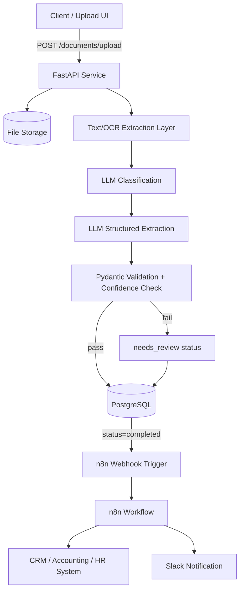

# AI Document Processing Platform

    

A multi-document-type AI extraction platform that turns unstructured uploads — invoices, contracts, resumes, and generic forms — into validated, structured, queryable data, then hands off the result to downstream business systems via n8n.

## Table of Contents
- [Project Overview](#project-overview)
- [Business Problem](#business-problem)
- [Solution](#solution)
- [Key Features](#key-features)
- [Use Cases](#use-cases)
- [System Architecture](#system-architecture)
- [Workflow](#workflow)
- [Tech Stack](#tech-stack)
- [Project Structure](#project-structure)
- [Installation](#installation)
- [Environment Variables](#environment-variables)
- [API Documentation](#api-documentation)
- [Automation Workflow (n8n)](#automation-workflow-n8n)
- [AI Architecture](#ai-architecture)
- [Database Design](#database-design)
- [Screenshots](#screenshots)
- [Demo Video](#demo-video)
- [Live Demo](#live-demo)
- [Testing](#testing)
- [Security](#security)
- [Error Handling](#error-handling)
- [Monitoring & Observability](#monitoring--observability)
- [Cost Considerations](#cost-considerations)
- [Limitations](#limitations)
- [Future Improvements](#future-improvements)
- [Troubleshooting](#troubleshooting)
- [Author](#author)
- [License](#license)

## Project Overview
Most small and mid-size teams still process invoices, contracts, resumes, and intake forms by hand: someone opens a PDF, reads it, and retypes the important fields into a spreadsheet or CRM. This platform automates that pipeline end-to-end — a document comes in, gets classified, gets its fields extracted by an LLM against a strict schema, gets validated, gets stored, and triggers a downstream n8n workflow (approval routing, CRM update, Slack alert, etc.).

It is built for teams who receive a steady stream of mixed document types and want a single ingestion point instead of one-off scripts per document type.

## Business Problem
Manual document processing is slow, error-prone, and doesn't scale with volume. Key pain points this addresses:
- Staff time spent re-keying data from PDFs into systems of record
- Inconsistent field extraction between different people
- No audit trail of what was extracted, when, and with what confidence
- No automatic routing of processed documents into existing tools (CRM, accounting, HR)

## Solution
A FastAPI service accepts uploads, runs OCR/text-extraction, classifies the document type with an LLM, extracts a type-specific structured schema (also via LLM, validated with Pydantic), persists everything in PostgreSQL, and — for records above the confidence threshold — triggers an n8n workflow webhook to continue the business process. Anything below threshold is flagged `needs_review` rather than silently accepted.

## Key Features
- Multi-format ingestion: PDF (text or scanned) and common image formats (PNG/JPG)
- Automatic document type classification (invoice, contract, resume, form, unknown)
- Type-specific structured extraction with Pydantic schema validation
- Fail-closed confidence handling — low-confidence extractions are queued for human review, never guessed
- Full audit log per document (status transitions, extraction attempts, errors)
- n8n webhook integration for downstream workflow automation
- Idempotent uploads via content-hash dedup
- REST API with OpenAPI/Swagger docs

## Use Cases
- **Accounts payable**: invoices auto-extracted and routed to an approval workflow before payment
- **HR intake**: resumes classified and parsed into structured candidate records for ATS import
- **Legal/ops**: contracts scanned for key terms (parties, dates, values) for a review queue
- **General intake forms**: structured capture of form submissions without custom code per form

## System Architecture



## Workflow
1. Client uploads a file to `POST /documents/upload`.
2. The file is hashed (SHA-256) for idempotency and saved to storage.
3. Text is extracted: native PDF text extraction first, OCR fallback (Tesseract) for scanned pages/images.
4. Claude classifies the document into one of: `invoice`, `contract`, `resume`, `form`, `unknown`.
5. Claude extracts a schema-specific structured payload for the classified type.
6. The payload is validated with Pydantic and a confidence score is computed.
7. Records above the confidence threshold are marked `completed` and POSTed to the configured n8n webhook. Records below threshold are marked `needs_review`.
8. All transitions are logged to `processing_logs` for audit/debugging.

## Detailed Workflow
See [`docs/workflow.md`](docs/workflow.md) for the full state machine and error paths.

## Tech Stack

| Category | Technology |
|---|---|
| Language | Python 3.11 |
| Backend | FastAPI, Pydantic, SQLAlchemy |
| AI | Anthropic Claude (structured extraction), swappable via `LLM_PROVIDER` |
| OCR / Parsing | pdfplumber (native text), pytesseract + pdf2image (OCR fallback) |
| Automation | n8n (webhook-triggered downstream workflow) |
| Database | PostgreSQL |
| DevOps | Docker, docker-compose, GitHub Actions |
| Testing | pytest, httpx, FastAPI TestClient |
| Security | API key auth, webhook HMAC signing, input validation |

## Project Structure
```text
ai-document-processing-platform/
├── src/
│   ├── main.py                # FastAPI app entrypoint
│   ├── config.py               # Settings via environment variables
│   ├── database.py             # SQLAlchemy engine/session
│   ├── models.py               # ORM models (Document, ExtractionResult, ProcessingLog)
│   ├── schemas.py               # Pydantic request/response + extraction schemas
│   ├── security.py             # API key auth, webhook signing
│   ├── ocr/
│   │   └── extractor.py         # Text extraction + OCR fallback
│   ├── ai/
│   │   ├── client.py            # Anthropic client wrapper
│   │   ├── classifier.py        # Document type classification
│   │   └── extractor.py         # Type-specific structured extraction
│   ├── services/
│   │   ├── document_service.py  # Orchestrates the pipeline
│   │   └── validation_service.py# Confidence + schema validation, fail-closed logic
│   ├── workflow/
│   │   └── n8n_client.py        # Webhook trigger to n8n
│   └── api/
│       └── routes.py            # HTTP endpoints
├── prompts/                    # Versioned LLM prompts
├── workflows/                  # n8n workflow export + docs
├── tests/
│   ├── unit/
│   └── integration/
├── docs/                        # Architecture, API, security, testing, etc.
├── docker/                      # Dockerfile, docker-compose.yml
├── scripts/                     # init_db.py, seed data
├── .github/workflows/           # CI pipeline
├── .env.example
└── requirements.txt
```

## Installation

### Prerequisites
- Python 3.11+
- PostgreSQL 15+ (or use the provided `docker-compose.yml`)
- Tesseract OCR installed on the host (`apt install tesseract-ocr poppler-utils`) if not using Docker
- An Anthropic API key
- (Optional) an n8n instance with a webhook trigger

### Local Setup
```bash
git clone https://github.com/sohaggain/ai-document-processing-platform.git
cd ai-document-processing-platform
python -m venv venv && source venv/bin/activate
pip install -r requirements.txt
cp .env.example .env    # fill in your values
python scripts/init_db.py
uvicorn src.main:app --reload
```

### Docker Setup
```bash
cp .env.example .env
docker compose -f docker/docker-compose.yml up --build
```

API docs available at `http://localhost:8000/docs`.

## Environment Variables
See [`.env.example`](.env.example) for the full list. Never commit a real `.env` file.

## Configuration
Runtime behavior (confidence threshold, max upload size, allowed file types) is controlled via environment variables in `src/config.py` — no code changes needed to tune thresholds per deployment.

## API Documentation
Full endpoint reference: [`docs/api.md`](docs/api.md). FastAPI also serves interactive Swagger UI at `/docs` and ReDoc at `/redoc`.

## Automation Workflow (n8n)
See [`workflows/workflow.md`](workflows/workflow.md) for the trigger, node breakdown, and error-handling path. A sanitized workflow export is at `workflows/n8n_workflow_export.json`.

## AI Architecture
See [`docs/ai-architecture.md`](docs/ai-architecture.md) — covers the classification/extraction prompt strategy, structured output enforcement, confidence scoring, and guardrails against prompt injection from document content.

## RAG Architecture
Not applicable — this platform performs extraction, not retrieval-augmented generation.

## Agent Architecture
Not applicable — this is a deterministic pipeline with two bounded LLM calls (classify, extract), not an autonomous agent.

## MCP Architecture
Not applicable in the current version.

## Database Design
See [`docs/database-schema.md`](docs/database-schema.md) for the full schema and ER diagram.

## Screenshots
Screenshots are not yet captured. Planned set (see [Screenshot Plan](#screenshots-1) below):
```text
docs/screenshots/01-upload-response.png
docs/screenshots/02-swagger-docs.png
docs/screenshots/03-document-record.png
docs/screenshots/04-needs-review-flag.png
docs/screenshots/05-n8n-workflow.png
```

## Demo Video
Demo video will be added after implementation.

## Live Demo
Live demo: Not publicly deployed yet.

## Testing
```bash
pytest tests/unit -v
pytest tests/integration -v
pytest --cov=src tests/
```
See [`docs/testing.md`](docs/testing.md) for the full test plan.

## Security
See [`docs/security.md`](docs/security.md). Summary: API key auth on all write endpoints, webhook HMAC signature verification, strict input validation (file type/size), LLM output re-validated through Pydantic before any write, no secrets in code/logs.

## Error Handling
- OCR failure → document marked `failed`, error logged, no partial writes
- LLM call failure/timeout → retried with exponential backoff (max 3 attempts), then `failed`
- LLM returns invalid JSON/schema mismatch → `needs_review`, raw output stored for inspection, never guessed into a clean record
- n8n webhook unreachable → retried independently; does not block or roll back the already-persisted document record

## Monitoring & Observability
Structured JSON logging on every pipeline stage; `processing_logs` table gives a queryable audit trail per document (status, latency, token usage where available). No external APM wired up by default — see [Future Improvements](#future-improvements).

## Cost Considerations
Two LLM calls per document (classify + extract). Cost scales with document count and length; exact numbers depend on your Anthropic plan and document size, so no fixed estimate is provided here — instrument `processing_logs.token_usage` to track real spend.

## Limitations
- OCR accuracy depends on scan quality; heavily degraded scans will land in `needs_review` more often
- Classification is limited to the four trained categories plus `unknown`
- No built-in user interface — API only
- Not yet load-tested for high-volume production traffic
- n8n workflow export is a template; it must be imported and credentials configured manually

## Future Improvements
- Add a lightweight review UI for `needs_review` documents
- Add reranking/self-consistency checks for low-confidence extractions
- Add per-document-type accuracy evaluation harness
- Add async/background task queue (Celery/RQ) for large batch uploads
- Add OpenTelemetry tracing

## Troubleshooting
See [`docs/troubleshooting.md`](docs/troubleshooting.md).

## Author
**Sohag Gain**
AI Automation Engineer | AI Agent Engineer | AI Solutions Builder

- Website: https://sohaggain.com
- GitHub: https://github.com/sohaggain
- LinkedIn: https://www.linkedin.com/in/sohaggain/

## License
MIT License — see [`LICENSE`](LICENSE).
