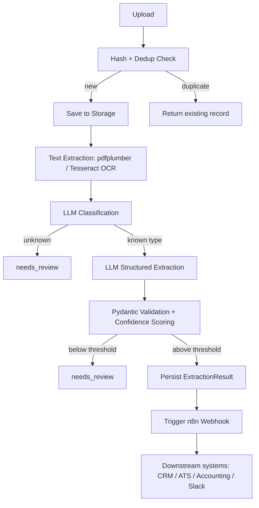

# Architecture

## High-Level Overview
The platform is a single FastAPI service with a linear, stage-based processing pipeline. Each stage writes its outcome to the database before the next stage begins, so the system can always report exactly where a document is and why it stopped.

## Component Responsibilities
| Component | Responsibility |
|---|---|
| `src/api/routes.py` | HTTP layer only — no business logic |
| `src/services/document_service.py` | Orchestrates the pipeline; the only place side effects are sequenced |
| `src/ocr/extractor.py` | Text extraction with OCR fallback |
| `src/ai/classifier.py`, `src/ai/extractor.py` | LLM calls, isolated from persistence |
| `src/services/validation_service.py` | Confidence scoring, fail-closed decision |
| `src/workflow/n8n_client.py` | Downstream webhook trigger, signed |
| `src/models.py` | Persistence schema |

## Why This Shape
- **LLM output never reaches storage or downstream systems unvalidated.** Every extraction result passes through a Pydantic schema before it is written to `extraction_results`, and confidence-gated before it is sent to n8n.
- **Each pipeline stage is independently logged** (`processing_logs`), so a stuck or failed document is diagnosable without re-running anything.
- **The n8n trigger is decoupled from the core transaction.** A webhook failure never rolls back or blocks the already-persisted, already-validated document record — it's logged and can be retried independently.
