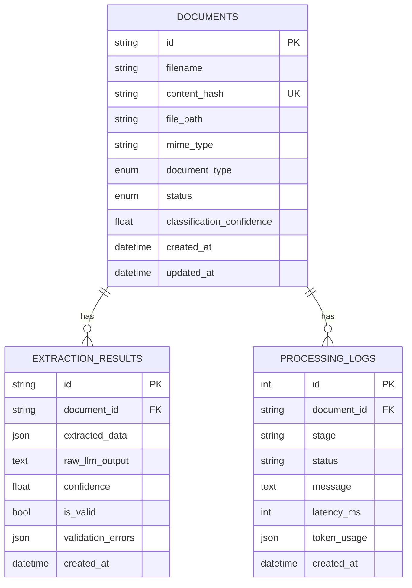

# Database Schema

## ER Diagram

## Notes
- `documents.content_hash` has a unique index — this is what makes upload idempotent (a duplicate upload returns the existing record instead of creating a new one).
- `extraction_results` keeps `raw_llm_output` alongside the validated `extracted_data` specifically so a `needs_review` record can be inspected by a human without re-calling the LLM.
- `processing_logs` is append-only and gives a full audit trail per document; it is the primary tool for debugging a stuck pipeline.
- No hard delete cascade beyond `documents` → its children (`cascade="all, delete-orphan"`), since a document without its extraction/log history has little value.
